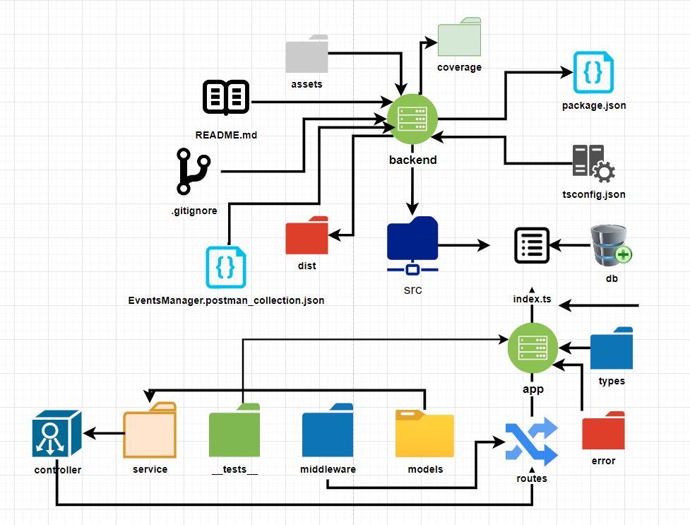
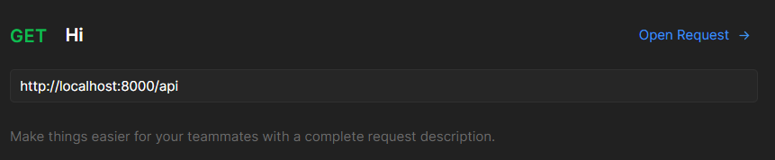
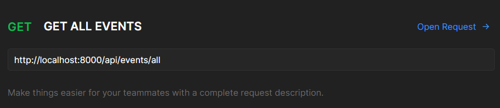
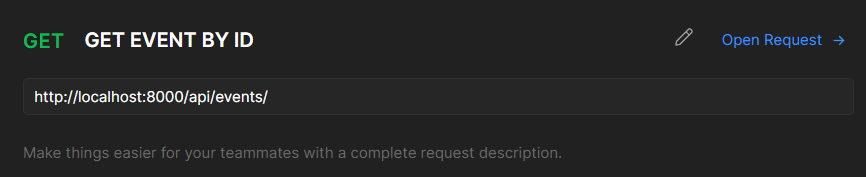
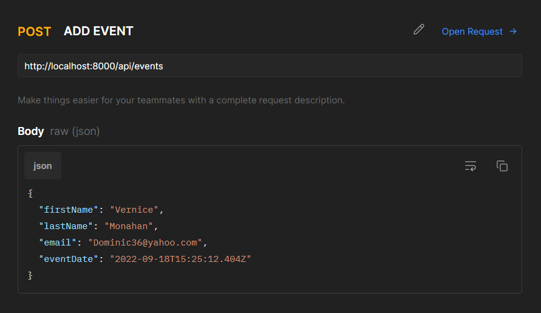
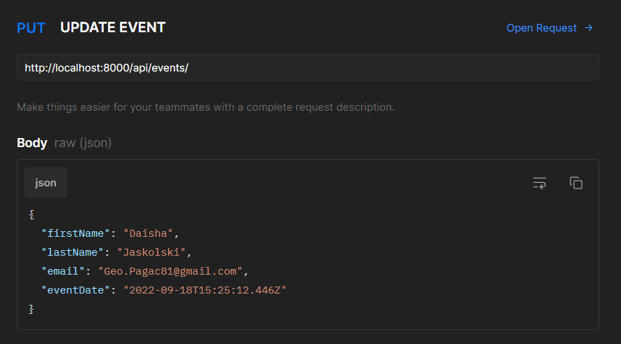
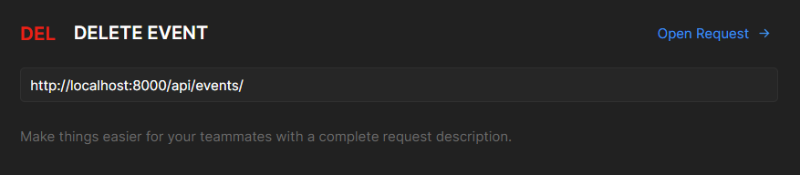
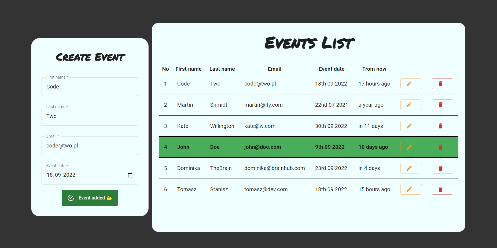
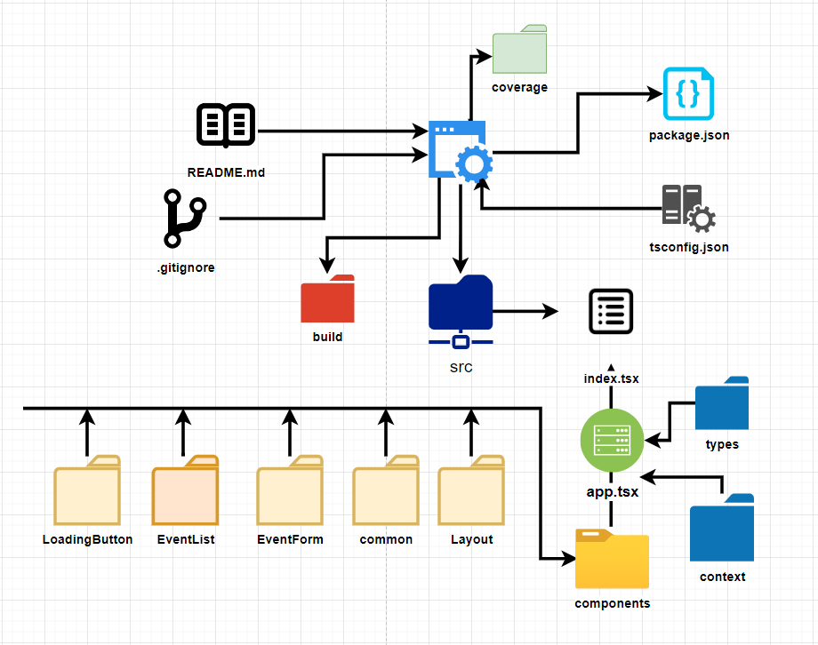

# Event Manager 2.0

### Ideas to realize for V2

DevOps:
- [ ] NX monorepo
- [ ] CI for tests
- [ ] Deployment on Vercel (api, web, mobile)
- [ ] CD for deployment
- [ ] Deployment on AWS EC2
- [ ] CD for AWS deployment

Backend:
- [ ] Backend NestJS + TypeORM + GraphQL
- [ ] Backend Login + QR code
- [ ] Testing with SuperTests 100% coverage
- [ ] Testing in Postman
- [ ] Morpheus + Grafana monitoring on Docker container 

Frontend:
- [ ] MSW
- [ ] Cypress
- [ ] Login
- [ ] Storybook
- [ ] MaterialUI DataGrid
- [ ] Dark Mode MUI
- [ ] Mobile responsive
- [ ] Toasts
- [ ] Map Location

Mobile:
- [ ] React Native
- [ ] Mobile tests in Detox

------

# Events Manager - backend v1

### The project has been prepared in TDD (Test Driven Development) methodology. 

### This was my first project in which I used this methodology, so I had to learn a lot of new things.

### Challanges

- I had to learn how to configure JEST with TypeScript.
- I had to learn how to use the TDD methodology and get used to writing small chunks.
- I had to learn how to use Sequelize library - previously been using TypeORM.
- I had to check TypeScript details in a lot of cases, typescript is a very powerful tool, but it is also very easy to make a mistake.

---
### Main project goal was to save the event with following fields: 
- first name 
- second name 
- email 
- date 

### Finally it was too little and, there is CRUD functionality for all events.

---
### Installation:
- clone the repository `git clone git@github.com:Fremen1990/events_manager.git` (if you have not done it yet for Front-end)
- go to the server folder `cd server`
- run `yarn` in the root directory

### Run the project:
- run `yarn dev` to start the server
- run `yarn test` to run tests
- run `yarn test:coverage` to run tests with coverage

---
### TECHNOLOGIES:

### - JavaScript 

### - TypeScript 

### - NodeJS  

### - Express 

### - Sqlite  

### - Sequelize 

-----

### TESTING: 
Current test coverage is 89% (see below).

 

[//]: # (### Jest )

[//]: # (### SuperTest )

----
## Application structure:

-----

### Avaialabel endpoints:

- GET /api - Hi message

- GET /api/events/all - get all events

- GET /api/events/:id - get event by id
- POST /api/events - create new event
- PUT /events/:id - update event by id
- DELETE /events/:id - delete event by id

----

### Packages:

    "typescript": "^4.8.3",
    "ts-node": "^10.9.1",
    "ts-node-dev": "^2.0.0",
    "jest": "^29.0.3",
    "ts-jest": "^29.0.1",
    "supertest": "^6.2.4"
    "config": "^3.3.8",
    "cors": "^2.8.5",
    "cross-env": "^7.0.3",
    "express": "^4.18.1",
    "express-validator": "^6.14.2",
    "sequelize": "^6.21.6",
    "sqlite3": "^5.0.11",
    "uuid": "^9.0.0"

----

### Project currently in progress, future improvements:

- [x] Prepare README
- [x] Prepare App flow
- [x] Create CRUD for Events
- [x] Add validations
- [x] Add error handling
- [x] Add more tests
- [x] Testing coverage report

-----
-----
-----
-----
-----
-----

# Events Manager - Front-End v1.0

### The project has been prepared in TDD (Test Driven Development) methodology.

### This was my first project in which I used this methodology, so I had to learn a lot of new things.

### Challanges:

- I had to learn how to use the TDD methodology and get used to writing small chunks without seeing it.
- I had to learn how to use React Testing Library with TypeScript.
- I had to find a way to test the components that use the Context API.

---
### Main project goal was to save the event with following fields:
- first name
- second name
- email
- date

### Finally, it was too little and there is CRUD functionality for all events with list of events.

---
### Installation:
- clone the repository `git clone git@github.com:Fremen1990/events_manager.git`
  (if you have not done it yet for Back-end)
- go to the client folder `cd clinet`
- run `npm install` in the root directory

### Run the project:
- run `yarn start` to start the server
- run `yarn test` to run tests
- run `yarn run react-scripts test -- --coverage --watchAll=false` to run tests with coverage

---
### TECHNOLOGIES:

### - JavaScript 

### - TypeScript 

### - React  

### - Styled Components 

### - Material UI  

-----

### TESTING:
Current test coverage is 89%

### Cypress  

### Cypress   - to be done in the future, currently learning 😊

----
## Application structure:

----

### Project currently in progress, future improvements:

- [x] Prepare README
- [x] Prepare App flow
- [x] Create CRUD for Events
- [x] Add validations
- [x] Add error handling
- [x] Add more tests
- [x] Testing coverage report
- [ ] Add Cypress Tests
